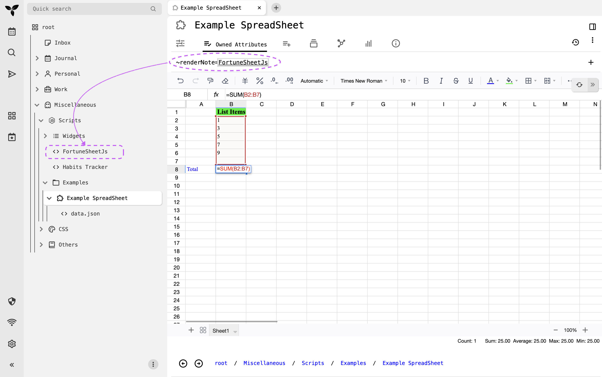

# Trilium Spreadsheet

A spreadsheet widget for [Trilium Notes](https://triliumnotes.org/) built with React and [FortuneSheet](https://github.com/ruilisi/fortune-sheet).



## Features

- Full-featured spreadsheet functionality within Trilium Notes
- Formula support (e.g., `=SUM(D2:D11)`)
- Cell formatting (colors, fonts, alignment)
- Multiple sheets support
- Data persistence of spreasheet data in Trilium

## Installation

### 1. Build the Project

First, install dependencies and build the project:

```bash
npm install
npm run build
```

This will create a bundled JavaScript file in the `dist/assets/` directory (typically named `index.js`).

### 2. Add to Trilium Notes

1. Copy the built file from `dist/assets/index.js` to somewhere inside your Trilium notes hierarchy with note type as `JS Frontend`.
2. Create a new note in Trilium to store this JavaScript code
3. Note the ID or path of this code note for the next step

### 3. Create a Spreadsheet Note

To create a new spreadsheet:

1. Create a new note in Trilium
2. Set the note type to **"Render Note"** (or create a render HTML note)
3. Add a **relation** to this new note:
   - Relation name: `~renderNote` eg: `~renderNote=@<build-source-code-note-id>`
   - Target: Point to the note containing the built JavaScript code from step 2

The spreadsheet widget will now render in your note!

## Usage

- Click on any cell to edit
- Use formulas by starting with `=` (e.g., `=SUM(A1:A10)`)
- Format cells using the toolbar
- Add multiple sheets using the sheet tabs at the bottom
- Data is automatically saved to Trilium

## Development

To run the development server:

```bash
npm run dev
```

This will start a local development server at `http://localhost:5173` (or similar).

## Project Structure

- `src/` - Source code
  - `App.jsx` - Main spreadsheet component
  - `main.jsx` - Application entry point
  - `index.css` - Styles
- `dist/` - Built output (generated)
- `vite.config.js` - Vite configuration

## Technologies

- React
- [FortuneSheet](https://github.com/ruilisi/fortune-sheet) (spreadsheet engine)
- Vite (build tool)

## License

See LICENSE file for details.

### TODOs:
- Use [Univer](https://docs.univer.ai/guides/sheets) instead of FortuneSheet 
